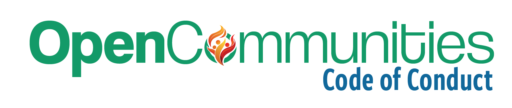

[_SparkForge Development_](https://sparkforge.dev) takes pride in creating quality open code and open communities. We are committed to providing a welcoming and inspiring community where our members create amazing projects and help each other grow.

## Our Open Communities Strive To

- **Be welcoming:** Our communities welcome and support people of all backgrounds and identities. This includes but is not limited to, members of any race, ethnicity, culture, national origin, color, immigration status, social and economic class, educational level, sex, sexual orientation, gender identity and expression, age, size, family status, political belief, religion, and mental and physical ability.
- **Help each other:** Our communities are open to participation by anyone interested in working on our projects, regardless of their level of experience with the code, language, or technology in general. We encourage development and contributions from all users, whatever their background may be, and seek to help each other hone our skills and attain new knowledge.
- **Be respectful:** We encourage thoughtful, constructive discussion of the code and this community, their current state, and possible directions for development. We recognize that people will have differences of opinion, that every design or implementation choice comes with various trade-offs, costs, and risks, and that often there are several correct answers, and sometimes none at all. The focus of our discussions should be the code and related technology, community projects, and infrastructure. Personal attacks and negative comments on personal characteristics are unacceptable and will not be permitted.
- **Understand disagreements:** Social and technical disagreements are frequently useful learning opportunities. Seek to understand the other viewpoints and resolve differences constructively. Disagreement is no excuse for poor behavior and poor manners. Judge the words and actions of other members favorably and assume they come from a place of good intention. Be willing to apologize when offense is given, whether or not it was intentional, and to tolerate the views of others.
- **Be professional:** Our communities exist to create fantastic code. Maintain professional decorum, avoid posting NSFW or sexual content, and avoid any conduct that would be reasonably construed as inappropriate in a professional setting. Remember that we build open communities, and your actions here impact your reputation in this community and others.
- **Maintain integrity in contributions:** We value honesty and transparency in the code we create. All submissions should be the original work of the contributor or appropriately credited when utilizing third-party code. It is crucial that all code we contribute to the community can be legally included in our projects. Just as in academic environments, we expect our members to uphold these standards and act with integrity in every aspect of their work.
- **Not police other communities:** Our communities do not exist in a vacuum. Our members participate in many other communities, which will have different purposes and standards. While we hope that any member of our community is always kind and respectful, we only enforce our standards in our community spaces, tools, and events or when a member is officially representing the community.

By adhering to these guidelines, we all commit to ensuring SparkForge Development's open communities remain welcoming, respectful, and professional for all members. This code of conduct is not exhaustive or complete. It serves to capture our shared understanding of a productive, collaborative environment. We expect the code to be followed in spirit as much as in the letter. We look forward to your contributions and to creating exceptional projects together.

This code of conduct draws on ideas from the following sources:

- [PostgreSQL Code of Conduct](https://www.postgresql.org/about/policies/coc/)
- [The Ruby Community Conduct Guideline](https://www.ruby-lang.org/en/conduct/)
- [The Rust Code of Conduct](https://github.com/rust-lang/prev.rust-lang.org/blob/master/en-US/conduct.md)
- [Microsoft Open Source Code of Conduct](https://microsoft.github.io/codeofconduct/)
- [Contributor Covenant](https://www.contributor-covenant.org)
