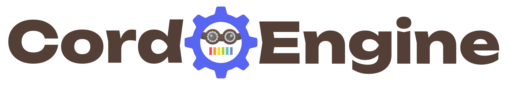

  <picture>
    <source media="(prefers-color-scheme: dark)"
      srcset="../assets/images/logo-dk.webp">
    <source media="(prefers-color-scheme: light)"
      srcset="../assets/images/logo-lt.webp">
    
  </picture>

Imagine a wondrous machine where ideas and code mesh like perfectly aligned gears, transforming into powerful Discord bots with a hiss of steam. Welcome to Cord Engine, where you engineer thriving communities while we fine-tune the intricate clockwork. Invest your energy in stoking the fires of engagement, not in tightening endless bolts – watch your digital realm chug to life as smoothly as a well-oiled locomotive!

Cord Engine is a Discord application framework built with [TypeScript](https://www.typescriptlang.org) and designed to run on [Bun](https://bun.sh), that allows developers to quickly build and deploy applications that are blazingly fast, secure and turns your server into a steampunk airship (well maybe not that last one).

  <a href="https://github.com/CordEngine/CordEngine">
    <picture>
      <source media="(prefers-color-scheme: dark)"
        srcset="https://dub.sh/UWDjz89">
      <source media="(prefers-color-scheme: light)"
        srcset="https://dub.sh/7WGd9l4">
      
    </picture>
  </a>
  <picture>
    <source media="(prefers-color-scheme: dark)"
      srcset="https://dub.sh/sCLUPTd">
    <source media="(prefers-color-scheme: light)"
      srcset="https://dub.sh/3SXQ5NU">
    
  </picture>
  <a href="https://github.com/orgs/CordEngine/projects/3">
    <picture>
      <source media="(prefers-color-scheme: dark)"
        srcset="https://img.shields.io/badge/Roadmap-ffe300?style=for-the-badge&logo=openstreetmap&logoColor=575757&label=Project&labelColor=c9b09a">
      <source media="(prefers-color-scheme: light)"
        srcset="https://img.shields.io/badge/Roadmap-ffe300?style=for-the-badge&logo=openstreetmap&label=Project&labelColor=543e36">
      
    </picture>
  </a>

  <a href="https://github.com/CordEngine/core/issues">
    <picture>
      <source media="(prefers-color-scheme: dark)"
        srcset="https://img.shields.io/github/issues/cordengine/core?style=for-the-badge&logo=github&logoSize=auto&logoColor=575757&label=Issues&labelColor=c9b09a&color=a3e60d">
      <source media="(prefers-color-scheme: light)"
        srcset="https://img.shields.io/github/issues/cordengine/core?style=for-the-badge&logo=github&logoSize=auto&label=Issues&labelColor=543e36&color=a3e60d">
      
    </picture>
  </a>
  <a href="https://github.com/CordEngine/core/wiki">
    <picture>
      <source media="(prefers-color-scheme: dark)"
        srcset="https://img.shields.io/badge/wiki-17bfff?style=for-the-badge&logo=google-docs&logoSize=auto&logoColor=575757&label=Documentation&labelColor=c9b09a">
      <source media="(prefers-color-scheme: light)"
        srcset="https://img.shields.io/badge/wiki-17bfff?style=for-the-badge&logo=google-docs&logoSize=auto&logoColor=white&label=Documentation&labelColor=543e36">
      
    </picture>
  </a>
  <a href="https://discord.gg/T5nhwPMSsJ">
    <picture>
      <source media="(prefers-color-scheme: dark)"
        srcset="https://img.shields.io/discord/1250847505566929037?style=for-the-badge&logo=discord&logoSize=auto&label=Support%20server&labelColor=c9b09a&color=9673ff">
      <source media="(prefers-color-scheme: light)"
        srcset="https://img.shields.io/discord/1250847505566929037?style=for-the-badge&logo=discord&logoSize=auto&label=Support%20server&labelColor=543e36&color=9673ff">
      
    </picture>
  </a>
  
  <a href="https://sparkforge.dev">
    <picture>
      <source media="(prefers-color-scheme: dark)"
        srcset="https://img.shields.io/badge/Spark🔥Forged-009966?style=for-the-badge">
      <source media="(prefers-color-scheme: light)"
        srcset="https://img.shields.io/badge/Spark🔥Forged-009966?style=for-the-badge">
      
    </picture>
  </a>

## Tech Stack

### Core

<a href="https://bun.sh">
  <picture>
    <source media="(prefers-color-scheme: dark)"
      srcset="https://img.shields.io/badge/dynamic/json?url=https%3A%2F%2Fgithub.com%2FCordEngine%2Fcore%2Fraw%2Fmain%2Fpackage.json&query=%24.engines.bun&style=for-the-badge&logo=bun&logoSize=auto&logoColor=575757&label=Bun&color=5865F2&labelColor=c9b09a">
    <source media="(prefers-color-scheme: light)"
      srcset="https://img.shields.io/badge/dynamic/json?url=https%3A%2F%2Fgithub.com%2FCordEngine%2Fcore%2Fraw%2Fmain%2Fpackage.json&query=%24.engines.bun&style=for-the-badge&logo=bun&logoSize=auto&label=Bun&color=5865F2&labelColor=543e36">
    
  </picture>
</a>
<a href="https://discord.com/developers/docs/reference">
  <picture>
    <source media="(prefers-color-scheme: dark)"
      srcset="https://img.shields.io/badge/v10-5865F2?style=for-the-badge&logo=discord&logoSize=auto&label=Discord%20API&color=5865F2&labelColor=c9b09a">
    <source media="(prefers-color-scheme: light)"
      srcset="https://img.shields.io/badge/v10-5865F2?style=for-the-badge&logo=discord&logoSize=auto&label=Discord%20API&color=5865F2&labelColor=543e36">
    
  </picture>
</a>
<a href="https://discordjs.dev">
  <picture>
    <source media="(prefers-color-scheme: dark)"
      srcset="https://dub.sh/OiH66Nn">
    <source media="(prefers-color-scheme: light)"
      srcset="https://dub.sh/8xY13tk">
    
  </picture>
</a>
<a href="https://valibot.dev">
  <picture>
    <source media="(prefers-color-scheme: dark)"
      srcset="https://dub.sh/3MdLn65">
    <source media="(prefers-color-scheme: light)"
      srcset="https://dub.sh/tJgFOnB">
    
  </picture>
</a>
<a href="https://moment.github.io/luxon/">
  <picture>
    <source media="(prefers-color-scheme: dark)"
      srcset="https://dub.sh/5jKQKM9">
    <source media="(prefers-color-scheme: light)"
      srcset="https://dub.sh/uMXm4zF">
    
  </picture>
</a>
<a href="https://github.com/kelektiv/node-cron">
  <picture>
    <source media="(prefers-color-scheme: dark)"
      srcset="https://dub.sh/yPqlJYi">
    <source media="(prefers-color-scheme: light)"
      srcset="https://dub.sh/3pqZWUR">
    
  </picture>
</a>

### Plugins

### Development

<a href="https://www.typescriptlang.org">
  <picture>
    <source media="(prefers-color-scheme: dark)"
      srcset="https://img.shields.io/github/package-json/dependency-version/cordengine/core/dev/typescript?style=for-the-badge&logo=typescript&logoSize=auto&label=TypeScript&color=5865F2&labelColor=c9b09a">
    <source media="(prefers-color-scheme: light)"
      srcset="https://img.shields.io/github/package-json/dependency-version/cordengine/core/dev/typescript?style=for-the-badge&logo=typescript&logoSize=auto&label=TypeScript&color=5865F2&labelColor=543e36">
    
  </picture>
</a>
<a href="https://biomejs.dev">
  <picture>
    <source media="(prefers-color-scheme: dark)"
      srcset="https://dub.sh/ChkySXJ">
    <source media="(prefers-color-scheme: light)"
      srcset="https://dub.sh/QdaplRJ">
    
  </picture>
</a>
<a href="https://github.com/DavidAnson/markdownlint">
  <picture>
    <source media="(prefers-color-scheme: dark)"
      srcset="https://img.shields.io/github/package-json/dependency-version/cordengine/core/dev/markdownlint-cli2?style=for-the-badge&logoSize=auto&label=markdownlint-cli2&color=5865F2&labelColor=c9b09a&logoColor=575757&logo=markdown">
    <source media="(prefers-color-scheme: light)"
      srcset="https://img.shields.io/github/package-json/dependency-version/cordengine/core/dev/markdownlint-cli2?style=for-the-badge&logoSize=auto&label=markdownlint-cli2&color=5865F2&labelColor=543e36&logo=markdown">
    
  </picture>
</a>
<a href="https://cla-assistant.io">
    <picture>
      <source media="(prefers-color-scheme: dark)"
      srcset="https://dub.sh/sBzc2MD">
    <source media="(prefers-color-scheme: light)"
      srcset="https://dub.sh/sMoVVzr">
    
    </picture>
  </a>
<a href="https://www.coderabbit.ai">
    <picture>
      <source media="(prefers-color-scheme: dark)"
      srcset="https://dub.sh/qIhMes8">
    <source media="(prefers-color-scheme: light)"
      srcset="https://dub.sh/jbnYjI6">
    
    </picture>
  </a>
  <a href="https://sonarcloud.io/organizations/cordengine/projects">
    <picture>
      <source media="(prefers-color-scheme: dark)"
      srcset="https://img.shields.io/badge/​Scanned-5865F2?style=for-the-badge&label=SonarCloud&labelColor=c9b09a&logo=sonarcloud">
    <source media="(prefers-color-scheme: light)"
      srcset="https://img.shields.io/badge/​Scanned-5865F2?style=for-the-badge&label=SonarCloud&labelColor=543e36&logo=sonarcloud">
    
    </picture>
  </a>
  <a href="https://docs.renovatebot.com">
    <picture>
      <source media="(prefers-color-scheme: dark)"
      srcset="https://img.shields.io/badge/Monitored-5865F2?style=for-the-badge&label=Renovate&labelColor=c9b09a&logo=renovate&logoColor=027fa0">
    <source media="(prefers-color-scheme: light)"
      srcset="https://img.shields.io/badge/Monitored-5865F2?style=for-the-badge&label=Renovate&labelColor=543e36&logo=renovate&logoColor=a3e5d9">
    
    </picture>
  </a>

## Code of Conduct

We are committed to providing a welcoming and inspiring community where our members create amazing projects and help each other grow. We ask that all all our inventors and tinkers follow the [Spark Forge Open Communities Code of Conduct](../CODE_OF_CONDUCT.md) to maintain a respectful and collaborative workshop environment.

## Contributing

We're excited to have you join our crew of inventors and tinkerers working to enhance Cord Engine!

**BEFORE** working on any features or fixes, please read our [Contributor's
Guide](../CONTRIBUTING.md) to help avoid any wasted or duplicate effort.

## License

Cord Engine is released under the [MIT License](../LICENSE), which means you're free to retrofit, recalibrate, and power your own contraptions with our machinery.
